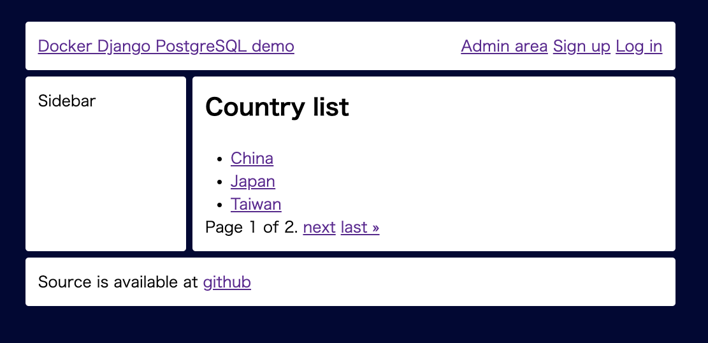
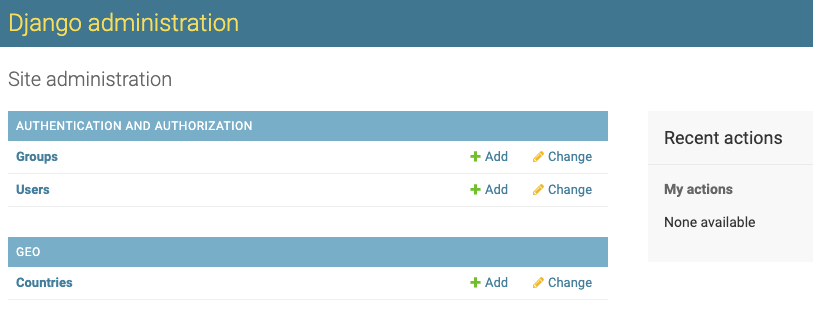

# docker-django-postgresql

## About this document / この文章について / 关于这个仓库

This document is maitained by writing in English, Japanese and Chinese.

この文章は英語・日本語・中国語で併記されていきます。

本文档以英文，日文和中文撰写。
___

## Purpose of this repository / このレポジトリの目的 /  此存储库的用途
[English]

This will help you to start Django's development using PostgreSQL with docker envrionment support.

In addition to binging up django system in default status, this project add some basic functions to help you to start django project.

Here is the list.

- Admin page
- Listing page with pagination function as example
- Load data as example
- User authentification
- Responsive desgin





"accounts" and "geo" are added applications to the default django's file structure, so if you don't need it, you can take it off by removing addtion of INSTALLED_APPS in djangopj/settings.py

[日本語]

このレポジトリは、Djangoの開発をPostgreSQLと一緒にDocker環境で開始する為のテンプレートとして役立ちます。

Djangoを初期状態で起動させるだけでなく、以下の機能を追加した状態で起動させます。

- 管理画面
- 例として項目のリストページ(ページネーション機能付き)
- 例としてデータのDBヘの取込み処理
- ユーザー登録・ログイン・ログアウト機能
- レスポンシブデザイン

プロダクションへのデプロイは、ローカルで生成したコードを本番に転送する事でシステムを動かす事も出来ますし、Dockerとして同じように稼働させる事も出来ます。

accountsとgeoがその為に追加されたアプリなので、必要なければdjangopj/settings.pyのINSTALLED_APPSから外して下さい。


リモートサーバーでの稼働はDockerとしてのデプロイも出来るでしょうが、唯コードを本番環境に転送して設定する形でも動きます。

[中文]

这将帮助您使用带有docker envrionment支持的PostgreSQL开始Django的开发。

除了以默认状态启动django系统外，该项目还添加了一些基本功能来帮助您启动django项目。

这是清单。

- 管理页面
- 以分页功能为例的列表页面
- 以加载数据为例
- 用户认证
- 响应式设计


“ accounts”和“ geo”是将应用程序添加到默认django的文件结构中，因此，如果不需要它，可以通过删除djangopj / settings.py中的INSTALLED_APPS添加来删除它
___

## Tech stack / 技術セット / 技术栈

- django 3.x + gunicorn + python 3 on CentOS

- nginx

- postgresql 12

[English]

djangopj is default django's folder and settings.py has customization at the tail of the file to use PostgreSQL without any change for initiation.

As default database of PostgreSQL, "example" is prepared.

You can confirm credentials to connect to DB in docker-compose.yml and settings.py.

[日本語]

djangopjがdjangoの初期開発用フォルダーになっています。settings.pyの末尾にはPostgreSQLを一旦は何も触らずDjangoと接続した形で使えるようにする為のカスタマイズが追加されています。

Djangoが使うPostgreSQLの初期設定のデータベースはexampleという名前になっています。

接続に必要な情報はdocker-compose.ymlまたはsettings.pyをご確認下さい。

[中文]

djangopj是django的默认文件夹，settings.py在文件的末尾进行了自定义，以使用PostgreSQL而无需进行任何初始化更改。

作为PostgreSQL的默认数据库，准备了“ example”。 

您可以在docker-compose.yml和settings.py中确认凭据以连接到数据库。

# How to use / どうやって使うか / 如何使用

[English]

Template is provided through

https://github.com/hikarine3/docker-django-postgresql

so click "Use this template" and start your project from there.

Then git clone your repository to your environment and start docker.


```
git clone git@github.com:hikarine3/docker-django-postgresql.git;
cd docker-django-postgresql;
docker-compose up -d;
```

For completion of settings, type
```
docker exec -i -t `docker ps|grep django_app_by_1stclass|awk '{print $1}'` python3 manage.py migrate;
```

Then load data by typing
```
docker exec -i -t `docker ps|grep django_app_by_1stclass|awk '{print $1}'` python3 manage.py loaddata geo/fixtures/country.json geo/fixtures/prefecture.json
```

You can see demo site with data now.

http://localhost/

To create the user who can log in admin screen, type

```
docker exec -i -t `docker ps|grep django_app_by_1stclass|awk '{print $1}'` python3 manage.py createsuperuser;
```

Then you can log in admin page through

http://localhost/admin/

[日本語]

テンプレートは

https://github.com/hikarine3/docker-django-postgresql

で配布されているので、"Use this template"のボタンを押して、貴方用のPJの開始に使って下さい。

それからgit cloneし、docker環境を立ち上げてください。

```
git clone git@github.com:hikarine3/docker-django-postgresql.git;
cd docker-django-postgresql;
docker-compose up -d;
```

それから
```
docker exec -i -t `docker ps|grep django_app_by_1stclass|awk '{print $1}'` python3 manage.py migrate;
```
と打ってから、デモ用データを
```
python3 manage.py loaddata geo/fixtures/country.json geo/fixtures/prefecture.json
```
と打つ事で初期データを入れる事が出来ます。

http://localhost/

で正常にサイトが稼働している事を確認して下さい。

それから管理画面にログインできるユーザーを作りましょう。

```
docker exec -i -t `docker ps|grep django_app_by_1stclass|awk '{print $1}'` python3 manage.py createsuperuser;
```

これで管理画面

http://localhost/admin/

にログイン出来るようになった筈です。

[中文]

通过提供模板

https://github.com/hikarine3/docker-django-postgresql

因此，请点击“使用此模板”，然后从此处开始您的项目。

然后git将您的存储库克隆到您的环境中，然后启动docker。

```
git clone git@github.com：hikarine3 / docker-django-postgresql.git;
cd docker-django-postgresql;
docker-compose up -d;
```

要完成设置，请键入
```
docker exec -i -t`docker ps | grep django_app_by_1stclass | awk'{print $ 1}'`python3 manage.py makemigrations;

docker exec -i -t`docker ps | grep django_app_by_1stclass | awk'{print $ 1}'`python3 manage.py migration;
```

然后你可以看到

http://localhost/admin/

创建可以登录管理员屏幕的用户

```
docker exec -i -t `docker ps|grep django_app_by_1stclass|awk '{print $1}'` python3 manage.py migrate;
```

然后通过键入加载数据
```
docker exec -i -t `docker ps|grep django_app_by_1stclass|awk '{print $1}'` python3 manage.py loaddata geo/fixtures/country.json geo/fixtures/prefecture.json
```

您现在可以看到带有数据的演示站点。

http://localhost/

要创建可以登录管理员屏幕的用户，请键入
```
docker exec -i -t `docker ps|grep django_app_by_1stclass|awk '{print $1}'` python3 manage.py createsuperuser;
```

然后您可以通过登录管理页面

http://localhost/admin/


# How to connect to PostgreSQL by docker / PostgreSQLへのdockerでのアクセス / 如何通过Docker连接到PostgreSQL
```
docker exec -i -t `docker ps|grep postgres_by_1stclass|awk '{print $1}'`  psql  --user postgres
```

# How to log in to django's application server / Djangoのアプリケーションサーバーへのdockerでのログイン / 如何登录Django的应用程序服务器
```
docker exec -i -t `docker ps|grep django_app_by_1stclass|awk '{print $1}'` /bin/bash;
```

# Recommendation to set alias / ショートカットとしてalias設定の推奨 / 建议设置alias
Docker's command is long, so it is recommended for you to use alias for some of commands.

Example:
```
alias dpsql="docker exec -i -t \`docker ps|grep postgres_by_1stclass|awk '{print \$1}'\`  psql  --user postgres";
```

```
alias dweb="docker exec -i -t \`docker ps|grep django_app_by_1stclass|awk '{print \$1}'\`"
```

# How Django's folder was created / 既に用意されてるdjangoの開発フォルダの作られ方 / Django文件夹的创建方式

```
PJ=djangopj;
django-admin startproject $PJ .;
cd $PJ;
python3 manage.py collectstatic;
```

# Related technical information / 関連技術の役立ち情報 / 相关技术资料

## 日本語(Japanese)
- [Dockerのインストール・設定方法](https://vpshikaku.com/docker%e3%81%ae%e3%82%a4%e3%83%b3%e3%82%b9%e3%83%88%e3%83%bc%e3%83%ab%e3%83%bb%e8%a8%ad%e5%ae%9a%e6%96%b9%e6%b3%95/)

- [Djangoのインストール/設定/開発方法(Django3.x対応)](https://vpshikaku.com/django%e3%81%ae%e3%82%a4%e3%83%b3%e3%82%b9%e3%83%88%e3%83%bc%e3%83%ab-%e8%a8%ad%e5%ae%9a-%e9%96%8b%e7%99%ba%e6%96%b9%e6%b3%95/)

- [PostgreSQLのインストール・設定・使い方](https://vpshikaku.com/postgresql%e3%81%ae%e3%82%a4%e3%83%b3%e3%82%b9%e3%83%88%e3%83%bc%e3%83%ab%e6%96%b9%e6%b3%95cent-os%e7%b3%bb%e3%81%ae%e5%a0%b4%e5%90%88/)

# License / ライセンス / 执照

MIT

# Author / 作者

## Name / 名前 / 全名
Hajime Kurita

## Twitter
- EN: https://twitter.com/hajimekurita
- JP: https://twitter.com/hikarine3

## Weibo
- CN: https://www.weibo.com/hajimekurita

## Corporation page / 会社ページ / 公司页面
- EN: https://1stclass.co.jp/en/
- CN: https://1stclass.co.jp/zh/
- JP: https://1stclass.co.jp/

## Blog
- EN: https://en.sakuhindb.com/pe/Administrator/
- JP: https://sakuhindb.com/pj/6_B4C9CDFDBFCDA4B5A4F3/

## Techincoal web services / 提供してる技術関連Webサービス / Techincoal Web服务
### VPS & Infra comparison / VPS比較 / VPS比较
- EN: https://vpsranking.com/en/
- CN: https://vpsranking.com/zh/
- JP: https://vpshikaku.com/

### Programming Language Comparison / プログラミング言語比較 / 编程语言比较
- EN: https://programminglang.com/en/
- CN: https://programminglang.com/zh/
- JP: https://programminglang.com/ja/

### OSS
- Docker: https://hub.docker.com/u/1stclass/
- Github: https://github.com/hikarine3
- NPM: https://www.npmjs.com/~hikarine3
- Perl: http://search.cpan.org/~hikarine/
- PHP: https://packagist.org/packages/hikarine3/
- Python: https://pypi.org/user/hikarine3/
